## 第一章 Dcoker简介

Docker主要概念：

- **镜像**（`Image`）
- **容器**（`Container`）
- **仓库**（`Repository`）
- `Docker Registry`

---

### 镜像Image

**镜像Image** 是一个类似于 `Linux` 的 `root` 一样的**文件系统**

与之不同，Docker 的镜像还包括一系列参数、环境变量等，但**不包括**动态数据（内容构建好不能改变）

---

### 容器Container

镜像（`Image`）和容器（`Container`）的关系，就像是面向对象程序设计中的 `类` 和 `实例` 一样，镜像是静态的定义，容器是镜像运行时的实体。容器可以被创建、启动、停止、删除、暂停等

---

### Docker Registry

镜像构建完成后，可以很容易的在当前宿主机上运行，但是，如果需要在其它服务器上使用这个镜像，我们就需要一个集中的存储、分发镜像的服务，[Docker Registry](https://vuepress.mirror.docker-practice.com/repository/registry.html) 就是这样的服务。

一个 **Docker Registry** 中可以包含多个 **仓库**（`Repository`）；每个仓库可以包含多个 **标签**（`Tag`）；每个标签对应一个镜像。

通常，一个仓库会包含同一个软件不同版本的镜像，而标签就常用于对应该软件的各个版本。我们可以通过 `<仓库名>:<标签>` 的格式来指定具体是这个软件哪个版本的镜像。如果不给出标签，将以 `latest` 作为默认标签。

以 [Ubuntu 镜像 (opens new window)](https://hub.docker.com/_/ubuntu)为例，`ubuntu` 是仓库的名字，其内包含有不同的版本标签，如，`16.04`, `18.04`。我们可以通过 `ubuntu:16.04`，或者 `ubuntu:18.04` 来具体指定所需哪个版本的镜像。如果忽略了标签，比如 `ubuntu`，那将视为 `ubuntu:latest`。

**仓库名**经常以 *两段式路径* 形式出现，比如 `jwilder/nginx-proxy`，前者往往意味着 Docker Registry 多用户环境下的用户名，后者则往往是对应的软件名。但这并非绝对，取决于所使用的具体 Docker Registry 的软件或服务。

---

### 延伸阅读

1. [DataWhale-Docker开源教程](https://github.com/datawhalechina/team-learning-program/tree/master/Docker)

