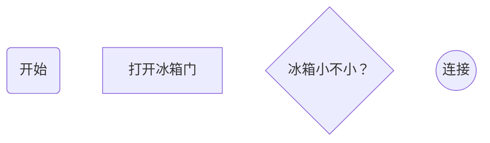
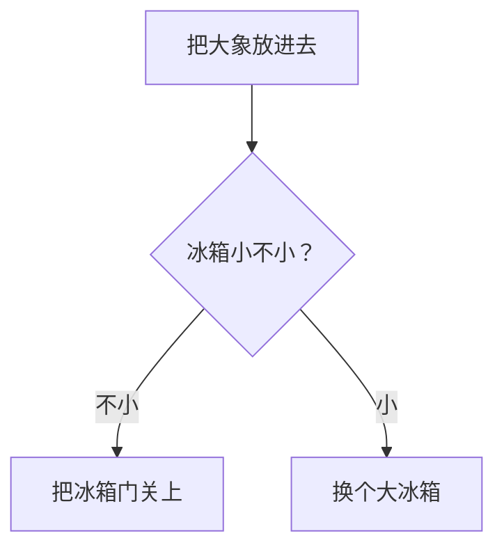

## Markdown 简明手册

本文内容为 Markdown 语法：

1. **字体**：倾斜加粗和删除线，以及字体颜色
2. **表格示例**
3. **特殊字符和书写规范**：'……', '——', '~'
4. **超链接**: [Anchor](#anchor)
5. **图片**
6. **流程图**


### Module 1: 字体

- `***加粗倾斜***`: ***加粗倾斜***
- `~~加删除线~~`: ~~这是加删除线~~
- `<center>居中</center>`：文字居中

### Module 2: 表格

表头|表头|表头
---|:--:|---:
内容|内容|内容
内容|内容|内容

### Module 3: 特殊字符

在**中文输入法**下
- `shift + 6`: ……
- `shift + ~`: ~
- `shift + -`: ——

同时日期和分钟之间要用表示: `10～20 10:00——16:00`

### Module 4: 超链接

#### Step 4.1: 行内式索引

`This is [an example](http://example.com/ "Title") inline link.`

This is [an example](http://example.com/ "Title") inline link.

`[This link](http://example.net/) has no title attribute.`

[This link](http://example.net/) has no title attribute.


#### Step 4.2: 参考式索引

`This is [an example][id] reference-style link.`

在文本的其他地方输入(适合参考文献)：

`[id]: http://example.com/  "Optional Title Here"`


#### Step 4.3: 内部索引

<span id="anchor">***锚点在这***</span>

首先定义`<span id = "anchor">锚点</span>`，id 自取

最后写：`[锚点](#anchor)`

### Module 5: 图片

* **图片索引**：

``

* **图片大小**：

``

### Module 6: 流程图

#### Step 1: **布局方向**

* **TB（Top Bottom)**：从上向下
* **BT**
* **LR（Left Right）**：从左到右
* **RL**

#### Step 2: **节点画法**

```md
graph TB
    A(开始)
    B[打开冰箱门]
    C{"冰箱小不小？"}
    D((连接))
```



#### Step 3: 连接线

有以下几种连接线:

- `-->`: 实线
- `-.->`：虚线
- `==>`：加粗
- `---`：无箭头

```md
graph TB
    A[把大象放进去] --> B{"冰箱小不小？"}
    B -->|不小| C[把冰箱门关上]
    B -->|小| D[换个大冰箱]
```



### 参考链接：

1. [会用 Markdown 还不够还得知道排版规范](https://zhuanlan.zhihu.com/p/69376149?utm_source=qq&utm_medium=social&utm_oi=1112411504128819200)
2. [Markdown 进阶技能：用代码画流程图（编程零基础也适用）](https://mp.weixin.qq.com/s?__biz=Mzg5OTE5MTY4Nw==&mid=2247483770&idx=1&sn=47eb659fcf86b9e3b7a15327c1b6f9b6&chksm=c0564792f721ce84c050174071d86abde69c4a8b2a3f068c4ad7b284138bf140cc26777c7fce&token=2124347599&lang=zh_CN#rd)
3. [Markdown语法及原理从入门到高级](https://zhuanlan.zhihu.com/p/99319314?utm_source=qq&utm_medium=social&utm_oi=1112411504128819200)