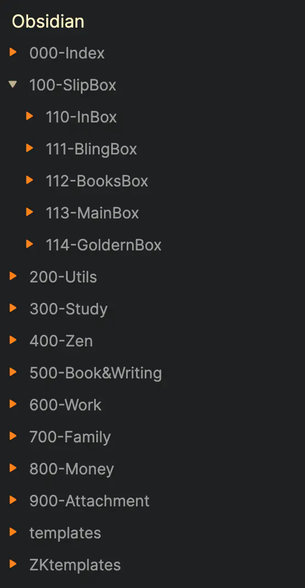
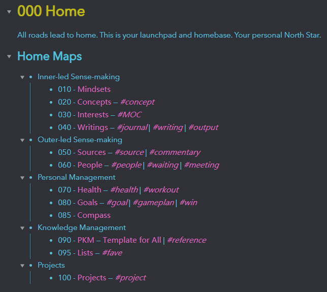

## Obsidian核心配置

本文对笔记软件 Obsidian 进行配置

---

### Step 1: 修改配置文件

将设置里打开允许编辑 CSS 选项

然后将本文目录中 `./attachments/obsidian.css` 放置在工程目录下，替换原有的文件

---

### Step 2: 文件树设置

[][1]

[大佬][1]的配置如下：



```shell
├─.obsidian
├─000-Index
├─100-SlipBox
│  ├─110-FleetingBox
│  ├─111-LiteratureBox
│  └─112-PermanentBox
└─Templates
    ├─defaultTemplates
    └─ZKTemplates
        └─defaultTemplates
```


---

### Step 3: 目录树设置




### 参考链接

[1]: https://www.jianshu.com/p/2def06958af6  "Obsidian手把手教你快速上手（附核心配置）"
[2]: https://github.com/obsidianzh/forum/discussions/31 "知识管理PKM/管理大量笔记的最佳实践"