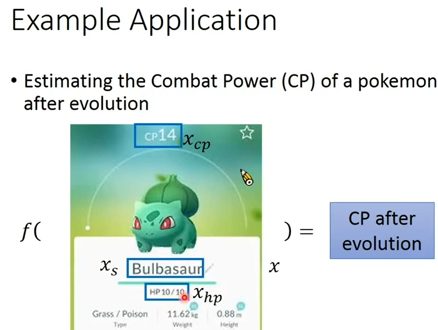
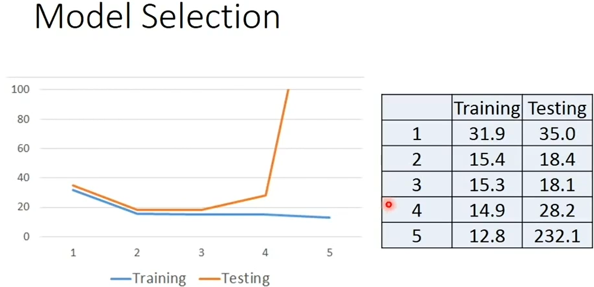

## Chapter1 Regression

 ### 第一步：什么是回归？

---

回归可用于许多场景，如：

- 股票预测
- 自动驾驶
- 推荐系统

回归的方式因应用而例，机器学习中的回归可以看作函数的输入输出，如$f(x)=numbers$

这里的输入数据$x$一般是数值，则输出**连续的数值**，而不是非连续的值，比如类别（猫、狗等）

### 第二步：宝可梦 CP 值研究

---

CP 值：可以认为是宝可梦的潜力指数或能力数值，为**连续的实数**

对于宝可梦的 CP 值预测，引用在回归任务中可以被认为：
$$
f(生命值，法力值，元素) = CP 值
$$
根据以上说明，我们可以开始定义这个模型 model：

- $y_{cp}$：预测后的CP值
- $x_{cp}$：预测前的CP值
- $w,b$：可以被看成是**任何**值，或者说随便填什么值都可以，我们的任务就是通过所谓的 “训练” 来得到这两个值（对，是得到$w,b$，而非$y_{cp}$）

$$
y_{cp}=b+w*x_{cp}
$$

### 第三步：线性模型研究

---

线性模型(Linear model)：可以看成是上诉代码的进化版本，数学表示为：
$$
y=b+\sum{w_{i}y_{i}}
$$
然后我们就可以研究回归模型了

假设我们有了**几只**宝可梦的数据，杰尼龟、皮卡丘等等，这些数据包含以下数值：

- 宝可梦HP
- 宝可梦元素（火系、草系）
- 宝可梦当前CP值
- 宝可梦进化后的CP值

从上诉数据中我们需要选择一个作为 label，其余的数值作为 features

我们把 **features** 当作 $x$（可以把同一宝可梦的这些数值排在一起作为**向量**），**label**作为 $y$

#### 任务1：线性函数输入格式

---

$$
f(x^{n})=\hat{y}^{n}
$$

首先确定函数结构，比如$w$的形状等等

#### 任务2：损失函数

---

- loss function：用来确定 model **输出**的数值与**实际**的数值 “差距”，也是一个函数

我们的目标是找到让损失函数最小的参数（$w,b$）
$$
w^{*},f^{*} = \arg\min_{w,b}L(w,b)
$$

> argmin：找出 w,b 的值，使损失函数 L(w,b) 的值最小，返回 w,b

#### 任务3：梯度下降

---

1. **随机**选取参数点 $w_{0},b_{0}$

2. 计算$\frac{dL}{dw}|_{w=w_{0}}$，也就是 L 对 $w_{0}$ 的微分，在这个线性函数中，微分就是：
   $$
   \frac{dL}{dw}|_{w=w_{0}}=x_{0}
   $$

3. 观察微分，可以知道需要找到损失函数的最小值，可以得出结论：

   3.1 Loss函数为正，则Loss函数**左小右大**，参数$w$需要**减小**

   3.2 Loss函数为负，则Loss函数**左大右小**，参数$w$需要**增大**

4. 更新参数

- $\theta$：被称为学习率，需要手动设置的超参数

$$
w_{1} = w_{0}-\theta\frac{dL}{dw}|_{w=w_{0}}
$$

不断重复上诉步骤，最终我们可以得到尽可能小的$w,b$

5. 计算梯度

在线性计算中，我们直接计算线性函数的微分即可，这里Loss函数为：
$$
L(w,b)=\sum\limits_{n=1}^{10}(\hat{y}^{n}-(b+w*x^{n}))^2
$$
我们直接对 $w$ 求导，根据链式法则
$$
\frac{dL}{dw}=\sum\limits_{n=1}^{10}2*(\hat{y}^{n}-(b+w*x^{n}))*(-x^{n})
$$

### 第四步：重新设计模型

---

根据上一步，我们已经训练出一个模型，但如果在陌生数据（也叫做 test_data）表现不好，我么需要重新设计模型，可以参考以下方法：

* **筛选数据**：参考训练图，直观看出哪些地方分布的数据不适合，可选择丢弃
* **增加数据量**：尽可能增加数据量，让模型尽可能适应其他数据

### 第五步：增加数据维度

---

线性函数不会拟合所有数据，可选择增加训练模型维度：
$$
y = b+w_{1}x+w_{2}x^2
$$
模型会变得更复杂，同时会有一些曲折，会拟合更多数据

这样问题就出来了，随着模型越复杂，模型在**陌生**数据表现不一定更好

这种情况被称为 “过拟合”。

### 第六步：应对过拟合

可以有以下选择：

* 增加数据量
* 选择合适模型维度
* 对 loss 函数设置 “惩罚”：惩罚可以理解为，Loss想要变得很小，我就给你“**加**”上东西，不让你所愿
* 选择合适的**特征**

### 第七步：总结

* model、损失函数、正则化（惩罚项）
* 对正则化理解不要过于死板，简单理解为设计一个函数让 Loss 函数变大，这个函数必须和原参数有关
* 选择合适的模型维度较为重要