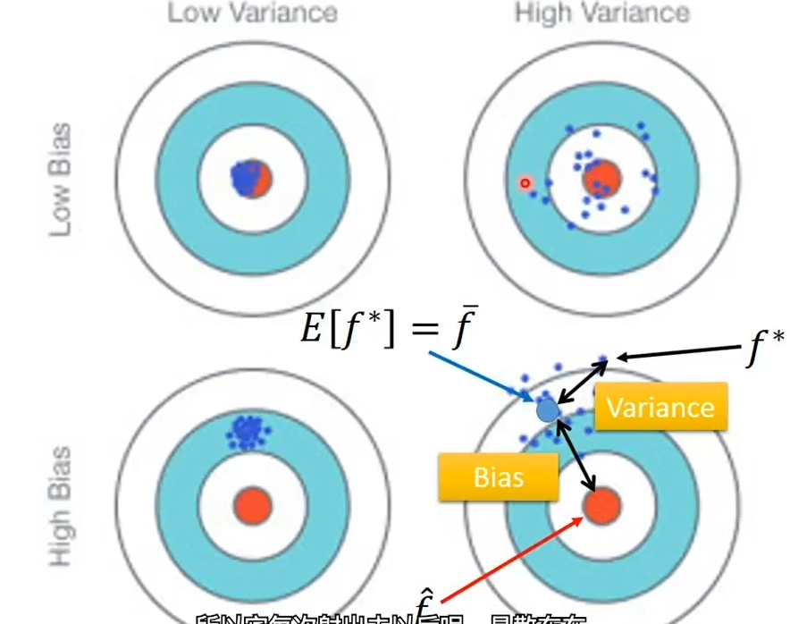

## 误差从何而来

本节主要讨论在训练中的误差的来源

## 简要分析

为了分析误差来源，提高模型性能，我们可以认为误差一般有两个来源：bias 和 variance

首先说明这样一个场景，在概率论中，样本均值和整体均值一般不相等

- 整体均值称为 $\mu$或期望
- $variance=\frac{\sigma^{2}}{样本数N}$

- $bias=E(S^2)=\frac{n-1}{n}\sigma^2$

对于两者之间的关系可以看

那么在 model 中，两者意思

- 大 bias：model 无法拟合训练集
  - 添加更多特征
  - 增加模型维度
- 大 variance：拟合训练数据，不拟合测试数据
  - 增加数据
  - 正则化regularization

对于分割训练、验证、测试集建议：

- 测试集上的误差大于在训练集上误差就不合格
- 计算每个模型在 train，val，test 上的误差，求平均，取误差最小的模型