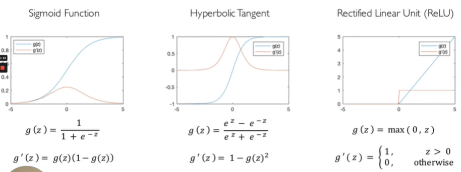

## 1.1 图像和向量

本文介绍了：

1. 常见激活函数
2. 深度学习任务分类
3. 经验风险和损失函数
4. Normalization分类
5. 课程推荐 coding 结构
---

### Step 1: 创建临时环境

主要的激活函数有：

---

### Step 2: Normalization的方法

该方法主要是**加快神经网络训练速度**，主要有以下

- batch
- layer
- Weight

---

### Step 3: CUDA方法

为什么选用GPU？

因为GPU可以对矩阵进行并行运算

---

### Step 4: 课程推荐coding方法

- 最好的结构：Pytorch + pytorch lighting
- 最好的模型：CNNS + RNNS + Transform
- 实验平台：Weights & bias
- 部署方案：Docker + AWS lambda